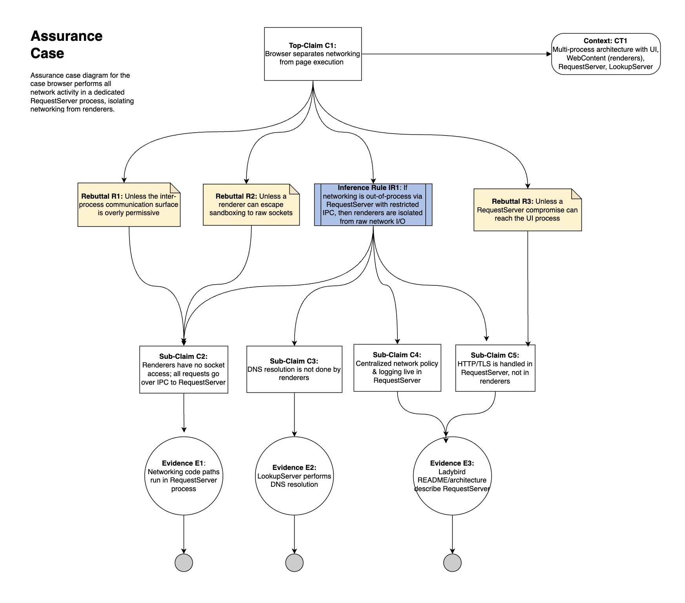

# Assurance Cases

## Top Claim #1 (Jason) - Browser protect user-stored data

=======

## Top Claim #2 (Logan) - 

## Top Claim #3 (Arun) - Browser ensures secure web connection

**Part2**
For the Secure Web Communication assurance case, most identified evidence—like TLS validation, certificate verification, and HTTPS enforcement—partially aligns with the current Ladybird Browser security framework.

- Available Evidence: Strong TLS integration and certificate verification     align with E1 (TLS Interoperability Scan Report) and E2 (Certificate Validation Tests).

- Needs Improvement: DNSSEC validation, HSTS enforcement, and certificate transparency are not fully implemented or documented, requiring additional effort to satisfy E3 and E4.

- Gap Summary: Core cryptographic protections exist, but user-facing validation and supporting documentation still need enhancement.

## Top Claim #4 (Alex) - 

## Top Claim #5 (Godwin) - Browser seperates networking from page execution

## AI Prompting
The following AI prompt was used to refine and improve assurance claim for protecting user-stored data
>You are an expert software security requirement engineer.\
>Your job is to suggest corrections or improvements in the phrasing of assurance claims. Claims concern critical properties that are risk-related. High confidence is needed in their realization.\
>A claim is always worded with a predicate. Avoid claims about the supporting method/techniques.\
>The rebuttles for the claim directly follow. A good rebuttal is characterized by its clarity, precision, and logical structure. It should directly address the key points of the opposing argument, refute logical fallacies, and provide strong evidence.\
>""" \
>These claims and rebuttles have already been developed:\
>Top-Claim C1: Browser maintains confidentiality of user data stored in the ladybird browser\
>Rebuttal R1: Insufficient Protection of Stored Credentials and Local Data\
>Rebuttal R2: Malicious Web Content Can Exploit Browser Flaws\
>Sub-Claim C2: The browser encrypts sensitive data at rest and enforces strict access control for local access\
>Rebuttal R3: Encryption and access control may be miscofigured or incomplete\
>Sub-Claim C3: Sandboxing and Enforcing strict content security policies (CSP) block malicious web content from accessing sensitive dataThe browser encrypts sensitive data at rest and enforces strict access control for local access\
>Rebuttal R4: Browser executes third-party scripts that expose user data\
>Sub-Claim C4: Sensitive data is not stored or leaked\
>Sub-Claim C5: Third-party scripts cannot access private user data\
>""" \
>Goal number 1: Critique the existing assurance claims and rebuttles. Suggest edits to strengthen an argement that would convince stakeholders in my assumed/hypothetical operational environment.\
>Goal number 2: Iterate additional or missing claims and rebuttles \
>Goal number 3: Help identify what evidene is needed to prove subclaims

## Part 2

From the File Download assurance case, there is evidence of filename prompting before downloading, but there is not a proactive threat intelligence service to highlight any URLs that should be blocked. This is a gap that could be remediated by having a way to import a third party intelligence list or even having an automatically updating threat list based on community additions. 

Because many behaviors of the software are user-facing, evidence of security features are often also visible through normal use. For the protection of user inputs, the masking of the password-type input's value is evident to users, and proving that scripts disallowed by a site aren't running can also be done via the console. This includes scripts disallowed by the Content Security Policy (since the HTTP responses from sites are visible in the console) and disallowed inline scripts. Evidence for the encyption of saved passwords, though, is not available and would require additional efforts to collect.

## Reflection
Logan: This assignment was particularly interesting for getting in the mindset of continually asking questions to probe how well the security questions are being answered. The rebuttal-subclaim cycle was particularly interesting, and seeing how my group members went about the process was insightful to see just how well the tactic can be leveraged. 

Arun: Working on the Secure Web Connection assurance case helped me bridge theoretical assurance modeling with practical browser security design. I learned how structured claims, rebuttals, and evidence can systematically build trust in mechanisms like TLS enforcement and certificate validation. The most valuable part was identifying evidence gaps, which showed how assurance cases complement software testing and documentation. This exercise also deepened my understanding of how open-source projects validate and communicate their security posture.

Alex: The "unless" style of argumentation really helped me break down arguments that I normally would struggle to break down, so that was a helpful characteristic of this diagram. This diagram also helped me learn methods of conveying information that is deep enough to convince an expert, but approachable enough to convince someone who is not an expert.

Godwin: This assignment allowed me to get familiar with decomposing claims and breaking down rebuttals and sub-claims. I was able to learn more about how Ladybird handles network seperation and also build on the foundations laid in class in assurance claim creation. The process was interesting becasue at times it seemed like I was starting bottom up in trying to create evidence for the claim and building off that until I reached the top level claim.