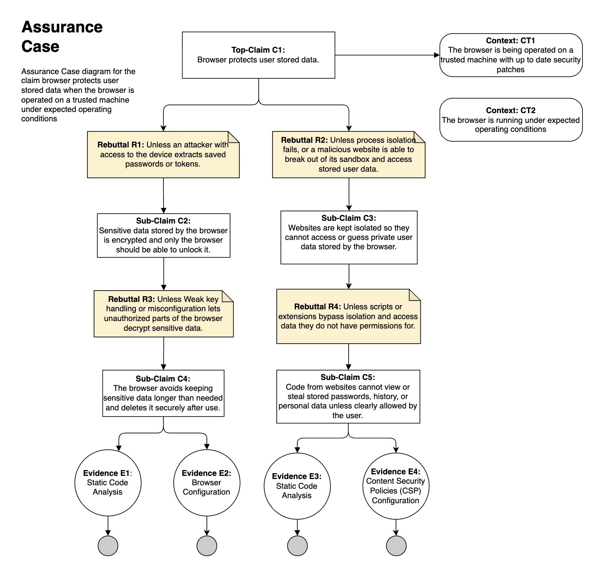

## Top Claim #1 (Jason) - Browser protect user-stored data

# Part 1

## Code-review strategy
As a team, we decided to use a hybrid approach to our code review of the ladybird browser codebase. The ladybird browser is a fairly large and complex codebase to analyze. Each of us took the misuse and assurance cases that we created in previous assignments and focused on the code that provided those capabilities. We are doing a hybrid of scenario based and weakness based code review. 

The code being C++ was going to add some complexity for automated scanning tools to perform a static analysis of the code because the tools would need to compile the code. We addressed these challenges by each team member selecting a different scanning tool to attempt. Between the five team members, we figured we should be able to get at least one or two automated code scanning tool results. We were able to successfully use Checkov and clang-analyzer, but were not able to get SonarQube to work. We also performed manual code reviews to bridge the gap of static analysis for the automated tools and in total put together a list of CWEs most relevant to our assurance cases.  

## CWE Analysis

## Summary of the manual code reviews that were performed
### CWE-201: Insertion of Sensitive Information Into Sent Data
<b>Abstraction:</b> Class

The code transmits data to another actor, but a portion of the data includes sensitive information that should not be accessible to that actor.

<b>What was reviewed:</b>

Searched the codebase for locations that implement outgoing request construction and cookie access. This identified places in the code that could lead to "Insertion of Sensitive Information Into Sent Data" (CWE-201).

>b>Key findings:</b> 

1.	In Libraries/LibWeb/Fetch/Fetching/Fetching.cpp cookies are explicitly appended to outgoing HTTP requests. If page_did_request_cookie is implemented incorrectly, it could include httpOnly cookies in contexts where they should not be exposed, for example JavaScript or it could return the cookie to the wrong origin which could leak sensitive information. 
2.	In Libraries/LibWeb/Fetch/Fetching/Fetching.cpp if the serialization of the referrer url contains sensitive information, for example query parameters with PII or authentication tokens in the URL, those could be sent to a third party in the Referer header.
3.	In Libraries/LibWeb/Fetch/Fetching/Fetching.cpp there is an unimplemented username/password prompt which creates a potential credential-flow risk. The code currently uses empty credentials and logs that prompting isn't implemented. When a prompt implementation is added later, ensure credential prompting does not accidentally auto-fill or send stored credentials into requests to unintended origins.
4.	 In Libraries/LibWeb/CookieStore/CookieStore.cpp httpOnly cookies are not provided via the VERIFY API. If an upstream cookie store accidentally returns httpOnly cookies, the VERIFY API could crash in debug or be bypassed which would expose cookies to non-HTTP APIs. 

### CWE-862: Missing Authorization
<b>Abstraction:</b> Class

The product does not perform an authorization check when an actor attempts to access a resource or perform an action.

<b>What was reviewed:</b>

Searched the codebase for places where privileged data or actions are exposed by IPC/callbacks, virtual PageClient methods, or FIXME'd navigation/security checks. These can lead to “Missing Authorization” (CWE-862)

<b>Key findings:</b>

1.	In Libraries/LibWeb/HTML/WorkerAgentParent.cpp a worker IPC callback such as when a potentially cross-origin worker asks for a cookie, the request if forwarded to the PageClient without an explicit origin or authorization checks. If the PageClient does not perform strict checks, a worker could obtain a cookie that it should not have access to. 
2.	In Services/WebWorker/PageHost.cpp the WebWorker PageHost forwards cookie requests directly to the client. Cookie requests are delegated directly to m_client.did_request_cookie with no visible check for worker identity, principal, or origin. If did_request_cookie trusts the caller context without verifying the worker's origin/principal, sensitive cookies could be leaked to worker contexts that are not authorized to read them.
3.	In Libraries/LibWeb/CookieStore/CookieStore.cpp the CookieStore relies on the PageClient to filter sensitive cookies. If PageClient inadvertently returns httpOnly cookies, or cookies it shouldn't, VERIFY may crash  and expose httpOnly cookies to JavaScript APIs.
4.	In Libraries/LibWeb/Page/Page.h the PageClient exposes virtual hooks for storing set/get values which embedders implement. The default implementation are no-op placeholders. If an embedder's override does not enforce origin/permission checks, or if some code calls these methods expecting them to perform checks, stored data could be read or written by code that lacks authorization.

### CWE-488: Exposure of Data Element to Wrong Session
<b>Abstraction:</b> Base

The product does not sufficiently enforce boundaries between the states of different sessions, causing data to be provided to, or used by, the wrong session.
Data can "bleed" from one session to another through member variables of singleton objects, such as Servlets, and objects from a shared pool.

<b>What was reviewed:</b>

Searched the codebase for places where critical variables or state (origins, principals, reserved clients, credentials, cookies, environment IDs) are assigned or overwritten from untrusted inputs or without proper checks. This can lead to “Exposure of Data Element to Wrong Session (CWE-488)

<b>Key findings</b>

1.	In Libraries/LibWeb/HTML/Scripting/WorkerEnvironmentSettingsObject.cpp the worker environment uses serialized outside settings to set top-level origin. The worker settings object receives top_level_origin from outside_settings which is a SerializedEnvironmentSettingsObject. This is serialized data. If that serialized data comes from an untrusted or malicious source, the worker's top-level origin, which is a critical security identifier used in trust decisions, can be overwritten. 
2.	In Libraries/ LibWeb/HTML/Scripting/ WindowsEnvironmentSettingsObject.cpp the windows environment creation_url and top-level origin are set from caller parameters. The creation_url and top_level_origin are key environment attributes used for same-origin decisions and secure-context determinations. They are taken directly from the caller's parameters. If an attacker can cause these parameters to be supplied with malicious values (e.g., via crafted IPC or API misuse), critical environment identity can be overwritten, undermining origin-based protections. 
3.	In Libraries/LibWeb/Fetch/Request.cpp the request constructor accepts origin and referrer requests from input requests. The Request object’s origin and referrer are assigned from input_request. Those fields affect CORS, service worker handling, and header generation. If input_request originates from untrusted sources or is constructed incorrectly, a request can carry a spoofed origin/referrer. If Spoofed origins/referrers are enable and can bypass same-origin checks, incorrect service worker routing, or leaking/accepting privileged behavior could occur.

### CWE-922: Insecure Storage of Sensitive Information
<b>Abstraction:</b> Class
The product stores sensitive information without properly limiting read or write access by unauthorized actors.
If read access is not properly restricted, then attackers can steal the sensitive information. If write access is not properly restricted, then attackers can modify and possibly delete the data, causing incorrect results and possibly a denial of service.

<b>What was reviewed:</b>

Search the codebase for places where the engine persists or exposes sensitive browser data (cookies, localStorage, other storage). Focused on CookieJar / StorageJar / persistence code paths and collected the most security-sensitive places that read/write persisted storage or expose persisted data to APIs. This could lead to “Insure Storage of Sensitive Information” (CWE-922) 

<b>Key findings</b>

1.	In Libraries/LibWebView/CookieJar.cpp the CookieJar loads persisted cookies and starts a periodic synchronization timer. All cookies are loaded eagerly into process memory. (There is a FIXME in the code to address this), which increases the attack surface.
2.	In Libraries/LibWebView/CookieJar.cpp persisted storage has direct access to Database and insert/select operations. Persisted storage provides direct database access. How the DB is created/opened and what permissions are applied will determine sensitivity of stored cookies. If the database is created in a location accessible by other users or processes, cookies may be exfiltrated from disk. If the database insertion code doesn't correctly enforce sameSite/secure/httpOnly semantics before writing, sensitive cookies could be persisted inadvertently.
3.	In Libraries/LibWebView/StorageJar.cpp the StorageJar persists web storage (localStorage-like APIs) and exposes set/get item paths. Any sensitive user data saved via localStorage/sessionStorage will be persisted. There is no evidence here of encryption or access controls at the storage layer. LocalStorage can be abused to persist tokens or PII and survive process restarts. If storage persists to a shared DB file with lax permissions, another user or process could read it.

### CWE-257: Storing Password in a Recoverable Format
<b>Abstraction:</b> Base
The storage of passwords in a recoverable format makes them subject to password reuse attacks by malicious users. In fact, it should be noted that recoverable encrypted passwords provide no significant benefit over plaintext passwords since they are subject not only to reuse by malicious attackers but also by malicious insiders. If a system administrator can recover a password directly, or use a brute force search on the available information, the administrator can use the password on other accounts.

<b>What was reviewed:</b>

Search the codebase for hardcoded passwords (SWE-257), API keys, default secrets, plaintext storage of credentials, 'password', 'secret', 'token', 'api_key', 'Authorization', 'basic', 'credentials', 'key', 'private', 'TODO: store', 'FIXME: password'

<b>Key findings</b>

1.	In Libraries/LibWeb/CredentialManagement/PasswordCredentials.h  PasswordCredential stores password as plain String (TODO to use secret type). Passwords are held in a normal String (m_password) and exposed via password() method that returns a String constant. The TODO explicitly notes the intent to switch to a secret container, but it is not yet done. Secrets in regular String objects are often immutable buffers that may be copied, swapped to disk via core dumps, swapped to swapfile, or logged unintentionally. 
2.	In Tests/LibWeb/Text/expected/Fetch/fetch-requst-url-search-params.txt there is an exposed plain text username and password.
3.	In Libraries/LibWeb/Cypto/Cryptokey.cpp the CryptoKey serialization includes "for_storage" path. In this scenario, private key material may be serialized. The code supports structured serialization with a for_storage flag that implies keys could be serialized for persistent storage which can possibly include private key material Private keys and secret symmetric keys, if serialized to storage as plaintext or in an extractable form, are secrets.

### CWE-940: Improper Verification of Source of a Communication Channel
<b>Abstraction:</b> Base
The product establishes a communication channel to handle an incoming request that has been initiated by an actor, but it does not properly verify that the request is coming from the expected origin.

<b>What was reviewed:</b>
Files related to encryption of network communications: LibTLS, LibCrypto/OpenSSL.cpp.

<b>Key findings</b>
Hostname verification is explicitly enabled in TLSv12.cpp. Handshake errors abort the connection, abandoning connections where verification fails.
OpenSSL cypher suites are not specified, instead relying on OpenSSL defaults. If the defaults are insecure, such as allowing aNULL cipher, this could lead to weakened security.

### CWE-605: Multiple Binds to the Same Port
<b>Abstraction:</b> Variant
When multiple sockets are allowed to bind to the same port, other services on that port may be stolen or spoofed.

<b>What was reviewed:</b>
Files for separate processes that may open sockets that could bind to the same port: Services/ImageDecoder, Services/WebContent, Services/WebDriver. Looking for socket creation and bind calls with SO_REUSEADDR options used.

<b>Key findings</b>
Went through all services that are separate processed that might open sockets. They all use an abstraction layer for socket creation (Core::Socket) that does not use the SO_REUSEADDR option when binding sockets.

### CWE-322: Key Exchange without Entity Authentication
<b>Abstraction:</b> Base
The product performs a key exchange with an actor without verifying the identity of that actor.

<b>What was reviewed:</b>
Checked that the TLS implementation verifies the server certificate against trusted root CAs. Also checked for proper hostname verification and minimum TLS version enforcement.

<b>Key findings</b>
Certificate trust is delegated to the OS certificate store. TLS 1.2 is the minimum version allowed. Hostnames are verified by default in the TLS handshake.

### CWE-347: Improper Verification of Cryptographic Signature
<b>Abstraction:</b> Base
The product does not verify, or incorrectly verifies, the cryptographic signature for data.

<b>What was reviewed:</b>
LibCrypto/Hash for signature verification functions, from the perspective of verifying hashes for script integrity. 

<b>Key findings</b>
The hash functions are in place (MD5, SHA1/2 files), but they are largely wrappers for OpenSSL functions. Relying on OpenSSL (a high-trust third party) for correct implementation.

Summary of the automated code reviews that were performed

# Part 2
There is a lot of repeat in part 2 of what was asked for in part 1.  In part 1, we include a summary of the manual and automated code review findings. In part 2 we add in the perceived risk in our hypothetical operational environments (which I think is a professional workspace)
For the planned contribution to the open-sourced project, we can pick one of the vulnerabilities that the automated code scanning identified. 