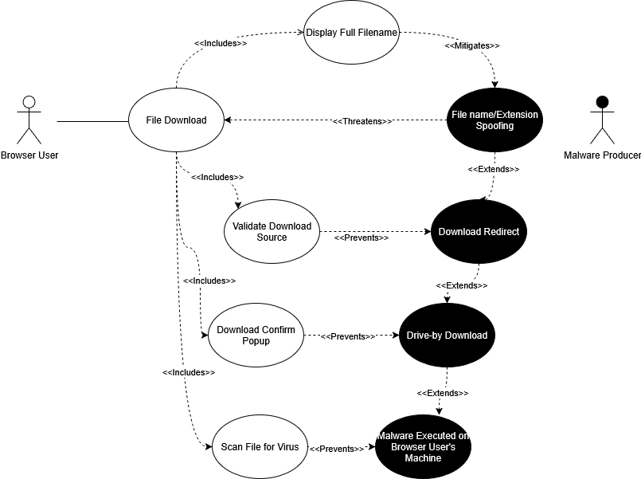
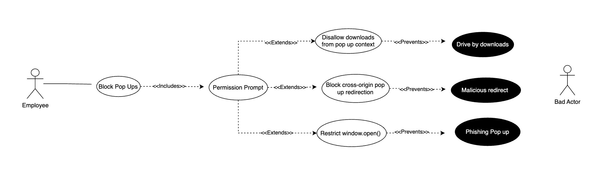
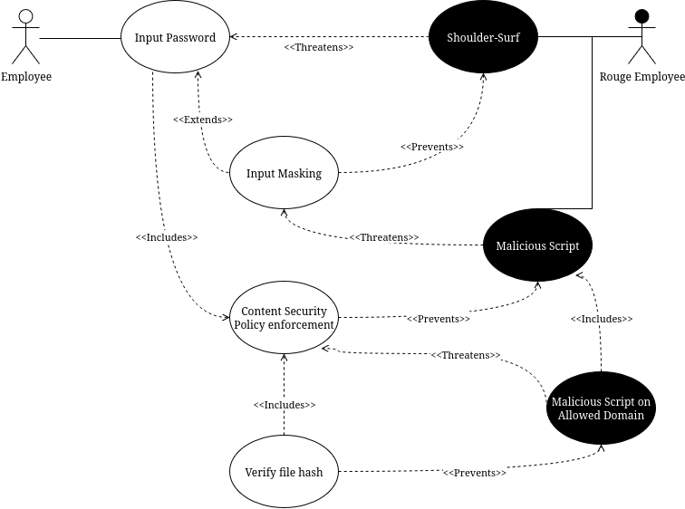

# Use Cases

Security requirements:
 - Hide the text inside Input elements of type `Password` by default.
 - Support Content Security Policy headers inside HTTP responses from sites.
 - Support the `script-src` directive (and similar derived directives) to specify specific allowed file hashes.

Implemented security features:
Supports Content Security Policy, supports script-src, script-src-elem, and script-src-attr. Supports using nonce values for use with dynamic, inline scripts. Ladybird seems to have the security requirements derived from this diagram implemented fully. When inspecting the code, I found comments specifying the W3C standard number for whatever was being implemented in that block, so it seems to be a thorough implementation that goes through the standard for all of these items.

I am investigating whether password inputs are obscured. I did not find any obvious references to this behavior within the HTMLInputElement.cpp file, but I will build Ladybird locally and experiment myself.

---

## Project board:
[Link](https://github.com/users/chauler/projects/3)

---

## Reflection:

Alex's reflection:
I found this assignment to be useful for getting me in the right mindset for useful security analysis. I started this class thinking "buffer overflows" and "modifying memory" - rarer and relatively difficult types of attacks. Trying to come up with good use/misuse cases helped me to remember the small security features we usually don't think of - in this case, it was obscuring password inputs. Starting from that foundation, I was more easily able to build out a diagram of more realistic threats.

---

## Part 2:
